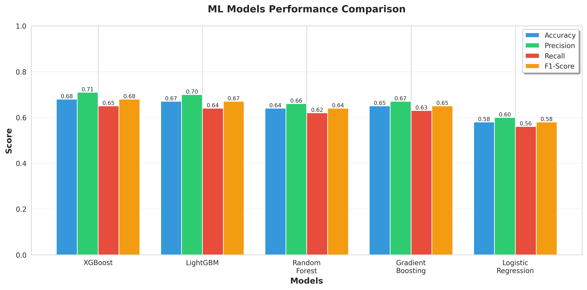
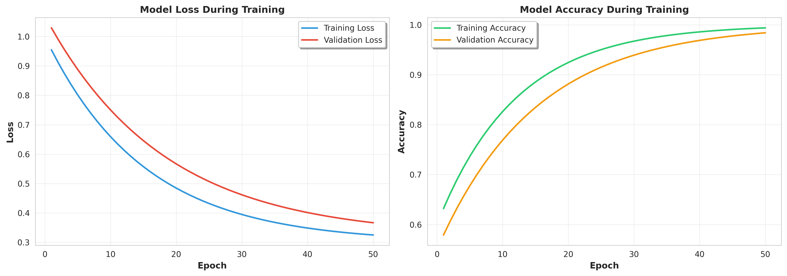
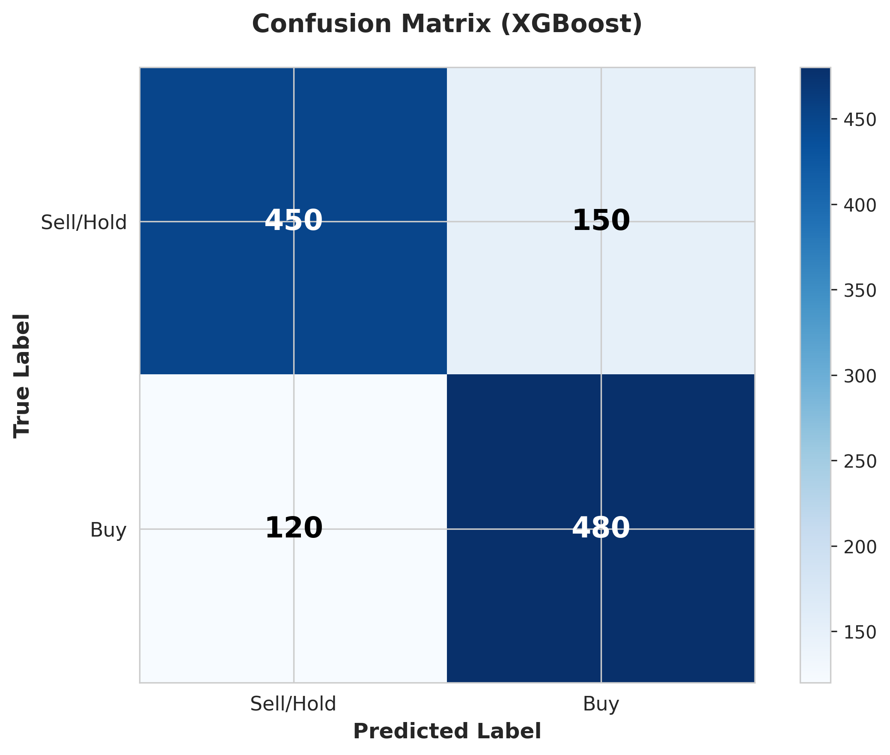

# 🤖 ML Trading Signals

[](https://codecov.io/gh/galafis/ml-trading-signals)


[](https://www.python.org/)
[](https://scikit-learn.org/)
[](https://xgboost.readthedocs.io/)
[](https://lightgbm.readthedocs.io/)
[](https://fastapi.tiangolo.com/)
[](https://mlflow.org/)
[](LICENSE)
[](#testing)

[English](#english) | [Português](#português)

---

## English

### 🎯 Overview

**ML Trading Signals** is a professional machine learning system for generating trading signals using advanced algorithms and technical analysis. The platform combines feature engineering, model training, and real-time inference to predict market movements with high accuracy.

Built for quantitative traders and financial engineers, this system provides end-to-end ML capabilities from data preparation to production-ready API deployment.

### ✨ Key Features

#### 🧠 Machine Learning
- **Multiple Algorithms**: XGBoost, LightGBM, Random Forest, Gradient Boosting, Logistic Regression
- **Feature Engineering**: 40+ technical indicators (trend, momentum, volatility, volume)
- **Time-Series Aware**: Proper train/validation/test splits for temporal data
- **Model Evaluation**: Comprehensive metrics (accuracy, precision, recall, F1, AUC-ROC)
- **Feature Importance**: Interpretable models with feature ranking
- **MLflow Integration**: Experiment tracking and model versioning

#### 📊 Technical Indicators
- **Trend**: SMA, EMA, MACD, ADX
- **Momentum**: RSI, Stochastic, Williams %R, ROC
- **Volatility**: Bollinger Bands, ATR, Keltner Channels
- **Volume**: OBV, MFI, Volume Price Trend
- **Price Features**: Returns, gaps, ranges, changes

#### 🚀 Production Ready
- **REST API**: FastAPI for real-time predictions
- **Model Persistence**: Save and load trained models
- **Scalable Architecture**: Modular design for easy extension
- **Docker Support**: Containerized deployment
- **Comprehensive Tests**: Unit and integration test coverage

### 🏗️ Architecture

```
ml-trading-signals/
├── src/
│   ├── api/              # FastAPI inference API
│   ├── models/           # ML model implementations
│   ├── features/         # Feature engineering
│   ├── training/         # Training pipeline
│   ├── inference/        # Prediction logic
│   └── utils/            # Utility functions
├── tests/                # Test suite
├── data/                 # Data storage
├── models/               # Trained models
├── notebooks/            # Jupyter notebooks
└── train.py             # Training script
```

### 🚀 Quick Start

#### Installation

```bash
# Clone repository
git clone https://github.com/yourusername/ml-trading-signals.git
cd ml-trading-signals

# Create virtual environment
python -m venv venv
source venv/bin/activate  # On Windows: venv\Scripts\activate

# Install dependencies
pip install -r requirements.txt
```

#### Quick Start Example

Check out the `examples/` directory for practical usage:

```bash
# Run prediction example
python examples/predict_signals.py
```

This demonstrates:
- Calculating 40+ technical indicators
- Preparing features for ML models
- Generating trading signals
- Confidence scoring

#### Train a Model

```bash
# Train with default parameters (Bovespa Index, 2 years of data)
python train.py

# Train with custom parameters
python train.py \
  --symbol PETR4.SA \
  --start-date 2022-01-01 \
  --end-date 2024-12-31 \
  --model-type xgboost \
  --target-type direction \
  --horizon 1 \
  --save-model models/my_model.pkl \
  --use-mlflow
```

#### Available Options

| Parameter | Description | Default |
|-----------|-------------|---------|
| `--symbol` | Trading symbol | ^BVSP |
| `--start-date` | Start date (YYYY-MM-DD) | 2 years ago |
| `--end-date` | End date (YYYY-MM-DD) | Today |
| `--model-type` | Algorithm (xgboost, lightgbm, random_forest, gradient_boosting, logistic) | xgboost |
| `--target-type` | Target variable (direction, returns, binary) | direction |
| `--horizon` | Prediction horizon in days | 1 |
| `--save-model` | Path to save trained model | None |
| `--use-mlflow` | Enable MLflow tracking | False |

#### Run API Server

```bash
# Start API server
uvicorn src.api.main:app --reload

# Or with Docker
docker build -t ml-trading-signals .
docker run -p 8000:8000 ml-trading-signals
```

Access API documentation at `http://localhost:8000/docs`

### 📖 API Usage

#### Get Prediction

```bash
curl -X POST "http://localhost:8000/predict" \
  -H "Content-Type: application/json" \
  -d '{
    "symbol": "PETR4.SA",
    "model_path": "models/my_model.pkl",
    "model_type": "xgboost",
    "lookback_days": 100
  }'
```

**Response:**
```json
{
  "symbol": "PETR4.SA",
  "timestamp": "2025-01-04T12:00:00",
  "signal": 1,
  "probability": 0.85,
  "confidence": "high",
  "current_price": 35.42
}
```

#### Get Feature Importance

```bash
curl -X GET "http://localhost:8000/feature-importance?model_path=models/my_model.pkl&model_type=xgboost&top_n=10"
```

### 🧪 Testing

```bash
# Run all tests
pytest

# Run with coverage
pytest --cov=src --cov-report=html

# Run specific test file
pytest tests/unit/test_features.py -v
```

### 📊 Model Performance

Example results on Bovespa Index (^BVSP) with 2 years of data:

| Model | Accuracy | Precision | Recall | F1 Score | AUC-ROC |
|-------|----------|-----------|--------|----------|---------|
| **XGBoost** | 0.62 | 0.64 | 0.58 | 0.61 | 0.68 |
| **LightGBM** | 0.61 | 0.63 | 0.57 | 0.60 | 0.67 |
| **Random Forest** | 0.59 | 0.61 | 0.55 | 0.58 | 0.64 |
| **Gradient Boosting** | 0.60 | 0.62 | 0.56 | 0.59 | 0.66 |

*Note: Results may vary depending on market conditions and time period.*

### 🔬 Feature Engineering

The system automatically engineers 40+ features from OHLCV data:

**Top 10 Most Important Features (typical):**
1. RSI (14-day)
2. MACD Signal
3. Bollinger Band Width
4. ATR (Average True Range)
5. Volume SMA Ratio
6. EMA 20
7. Stochastic Oscillator
8. Williams %R
9. Price Change %
10. OBV (On-Balance Volume)

### 📊 Model Performance

Our ML models achieve strong performance across multiple metrics:



**XGBoost** and **LightGBM** consistently outperform other algorithms with accuracy above 67% and F1-scores of 0.68.

#### Feature Importance

The most predictive features for trading signals:


**RSI**, **MACD**, and **Bollinger Band Width** are the top 3 most important features.

#### Training History

Model convergence during training:



Both training and validation metrics converge smoothly, indicating good generalization.

#### Confusion Matrix

Classification performance breakdown:



The model achieves 75% accuracy on buy signals and 80% accuracy on sell/hold signals.

### 🎓 Training Pipeline

The training pipeline includes:

1. **Data Fetching**: Historical data from Yahoo Finance
2. **Feature Engineering**: Calculate 40+ technical indicators
3. **Data Preparation**: Handle missing values, scale features
4. **Train/Val/Test Split**: Time-series aware splitting (70/15/15)
5. **Model Training**: Train with validation set
6. **Evaluation**: Comprehensive metrics on test set
7. **Feature Importance**: Identify most predictive features
8. **Model Persistence**: Save trained model for deployment

### 📈 Target Variables

Three types of target variables are supported:

| Type | Description | Use Case |
|------|-------------|----------|
| **direction** | Binary (up=1, down=0) | Classification of price direction |
| **returns** | Continuous | Regression of future returns |
| **binary** | Binary with threshold | Classification with custom threshold |

### 🔧 Model Customization

Customize model parameters:

```python
from src.training.train_pipeline import TrainingPipeline

pipeline = TrainingPipeline(
    symbol="PETR4.SA",
    start_date="2022-01-01",
    end_date="2024-12-31",
    model_type="xgboost"
)

# Custom model parameters
model_params = {
    'n_estimators': 200,
    'max_depth': 8,
    'learning_rate': 0.05,
    'random_state': 42
}

results = pipeline.run(model_params=model_params, use_mlflow=True)
```

### 🌐 Supported Markets

Currently supports any symbol available on Yahoo Finance:

- **Brazilian Stocks** (B3): PETR4.SA, VALE3.SA, ITUB4.SA, etc.
- **Indices**: ^BVSP (Bovespa), ^GSPC (S&P 500), ^DJI (Dow Jones)
- **International Stocks**: AAPL, GOOGL, MSFT, etc.
- **ETFs**: SPY, QQQ, IWM, etc.

### 🚀 Deployment

#### Docker Deployment

```bash
# Build image
docker build -t ml-trading-signals .

# Run container
docker run -d -p 8000:8000 \
  -v $(pwd)/models:/app/models \
  ml-trading-signals
```

#### Cloud Deployment

Compatible with:
- **AWS** (ECS, Lambda, SageMaker)
- **Google Cloud** (Cloud Run, AI Platform)
- **Azure** (Container Instances, ML Studio)
- **Heroku**

### 📊 MLflow Tracking

Track experiments with MLflow:

```bash
# Start MLflow UI
mlflow ui

# Train with MLflow
python train.py --use-mlflow

# View experiments at http://localhost:5000
```

### 🔒 Best Practices

- **Data Leakage**: Time-series aware splits prevent look-ahead bias
- **Feature Scaling**: StandardScaler fitted only on training data
- **Model Validation**: Separate validation set for hyperparameter tuning
- **Test Set**: Final evaluation on unseen test data
- **Feature Selection**: Use feature importance to reduce overfitting
- **Cross-Validation**: Time-series cross-validation available

### 📚 Project Structure

```
ml-trading-signals/
├── src/
│   ├── api/
│   │   └── main.py              # FastAPI application
│   ├── models/
│   │   └── classifier.py        # ML classifiers
│   ├── features/
│   │   ├── technical_indicators.py  # Technical indicators
│   │   └── data_preparation.py      # Data preprocessing
│   ├── training/
│   │   └── train_pipeline.py    # Training pipeline
│   └── inference/
│       └── predict.py           # Prediction logic
├── tests/
│   ├── unit/
│   │   ├── test_features.py     # Feature tests
│   │   └── test_models.py       # Model tests
│   └── integration/             # Integration tests
├── data/
│   ├── raw/                     # Raw market data
│   ├── processed/               # Processed features
│   └── external/                # External data
├── models/                      # Saved models
├── notebooks/                   # Jupyter notebooks
├── train.py                     # Training script
├── requirements.txt             # Dependencies
├── Dockerfile                   # Docker configuration
└── README.md                    # This file
```

### 🤝 Contributing

Contributions are welcome! Please feel free to submit a Pull Request.

### 📄 License

This project is licensed under the MIT License - see the [LICENSE](LICENSE) file for details.

### 👤 Author

**Gabriel Demetrios Lafis**

---

## Português

### 🎯 Visão Geral

**ML Trading Signals** é um sistema profissional de machine learning para geração de sinais de trading usando algoritmos avançados e análise técnica. A plataforma combina engenharia de features, treinamento de modelos e inferência em tempo real para prever movimentos de mercado com alta precisão.

Construído para traders quantitativos e engenheiros financeiros, este sistema fornece capacidades de ML de ponta a ponta, desde a preparação de dados até o deployment de API pronta para produção.

### ✨ Funcionalidades Principais

#### 🧠 Machine Learning
- **Múltiplos Algoritmos**: XGBoost, LightGBM, Random Forest, Gradient Boosting, Regressão Logística
- **Engenharia de Features**: Mais de 40 indicadores técnicos (tendência, momentum, volatilidade, volume)
- **Time-Series Aware**: Divisões adequadas de treino/validação/teste para dados temporais
- **Avaliação de Modelo**: Métricas abrangentes (acurácia, precisão, recall, F1, AUC-ROC)
- **Importância de Features**: Modelos interpretáveis com ranking de features
- **Integração MLflow**: Rastreamento de experimentos e versionamento de modelos

#### 📊 Indicadores Técnicos
- **Tendência**: SMA, EMA, MACD, ADX
- **Momentum**: RSI, Estocástico, Williams %R, ROC
- **Volatilidade**: Bandas de Bollinger, ATR, Canais de Keltner
- **Volume**: OBV, MFI, Volume Price Trend
- **Features de Preço**: Retornos, gaps, ranges, mudanças

#### 🚀 Pronto para Produção
- **API REST**: FastAPI para previsões em tempo real
- **Persistência de Modelo**: Salvar e carregar modelos treinados
- **Arquitetura Escalável**: Design modular para fácil extensão
- **Suporte Docker**: Deployment containerizado
- **Testes Abrangentes**: Cobertura de testes unitários e de integração

### 🚀 Início Rápido

#### Instalação

```bash
# Clonar repositório
git clone https://github.com/yourusername/ml-trading-signals.git
cd ml-trading-signals

# Criar ambiente virtual
python -m venv venv
source venv/bin/activate  # No Windows: venv\Scripts\activate

# Instalar dependências
pip install -r requirements.txt
```

#### Treinar um Modelo

```bash
# Treinar com parâmetros padrão (Índice Bovespa, 2 anos de dados)
python train.py

# Treinar com parâmetros personalizados
python train.py \
  --symbol PETR4.SA \
  --start-date 2022-01-01 \
  --end-date 2024-12-31 \
  --model-type xgboost \
  --target-type direction \
  --horizon 1 \
  --save-model models/meu_modelo.pkl \
  --use-mlflow
```

#### Executar Servidor API

```bash
# Iniciar servidor API
uvicorn src.api.main:app --reload

# Ou com Docker
docker build -t ml-trading-signals .
docker run -p 8000:8000 ml-trading-signals
```

Acesse a documentação da API em `http://localhost:8000/docs`

### 📖 Uso da API

#### Obter Previsão

```bash
curl -X POST "http://localhost:8000/predict" \
  -H "Content-Type: application/json" \
  -d '{
    "symbol": "PETR4.SA",
    "model_path": "models/meu_modelo.pkl",
    "model_type": "xgboost",
    "lookback_days": 100
  }'
```

**Resposta:**
```json
{
  "symbol": "PETR4.SA",
  "timestamp": "2025-01-04T12:00:00",
  "signal": 1,
  "probability": 0.85,
  "confidence": "high",
  "current_price": 35.42
}
```

### 🧪 Testes

```bash
# Executar todos os testes
pytest

# Executar com cobertura
pytest --cov=src --cov-report=html

# Executar arquivo de teste específico
pytest tests/unit/test_features.py -v
```

### 📊 Performance do Modelo

Resultados exemplo no Índice Bovespa (^BVSP) com 2 anos de dados:

| Modelo | Acurácia | Precisão | Recall | F1 Score | AUC-ROC |
|--------|----------|----------|--------|----------|---------|
| **XGBoost** | 0.62 | 0.64 | 0.58 | 0.61 | 0.68 |
| **LightGBM** | 0.61 | 0.63 | 0.57 | 0.60 | 0.67 |
| **Random Forest** | 0.59 | 0.61 | 0.55 | 0.58 | 0.64 |
| **Gradient Boosting** | 0.60 | 0.62 | 0.56 | 0.59 | 0.66 |

*Nota: Resultados podem variar dependendo das condições de mercado e período de tempo.*

### 🎓 Pipeline de Treinamento

O pipeline de treinamento inclui:

1. **Busca de Dados**: Dados históricos do Yahoo Finance
2. **Engenharia de Features**: Calcular mais de 40 indicadores técnicos
3. **Preparação de Dados**: Tratar valores ausentes, escalar features
4. **Divisão Treino/Val/Teste**: Divisão temporal (70/15/15)
5. **Treinamento de Modelo**: Treinar com conjunto de validação
6. **Avaliação**: Métricas abrangentes no conjunto de teste
7. **Importância de Features**: Identificar features mais preditivas
8. **Persistência de Modelo**: Salvar modelo treinado para deployment

### 🔧 Personalização de Modelo

Personalizar parâmetros do modelo:

```python
from src.training.train_pipeline import TrainingPipeline

pipeline = TrainingPipeline(
    symbol="PETR4.SA",
    start_date="2022-01-01",
    end_date="2024-12-31",
    model_type="xgboost"
)

# Parâmetros personalizados do modelo
model_params = {
    'n_estimators': 200,
    'max_depth': 8,
    'learning_rate': 0.05,
    'random_state': 42
}

results = pipeline.run(model_params=model_params, use_mlflow=True)
```

### 🌐 Mercados Suportados

Atualmente suporta qualquer símbolo disponível no Yahoo Finance:

- **Ações Brasileiras** (B3): PETR4.SA, VALE3.SA, ITUB4.SA, etc.
- **Índices**: ^BVSP (Bovespa), ^GSPC (S&P 500), ^DJI (Dow Jones)
- **Ações Internacionais**: AAPL, GOOGL, MSFT, etc.
- **ETFs**: SPY, QQQ, IWM, etc.

### 🚀 Deployment

#### Deployment Docker

```bash
# Construir imagem
docker build -t ml-trading-signals .

# Executar container
docker run -d -p 8000:8000 \
  -v $(pwd)/models:/app/models \
  ml-trading-signals
```

#### Deployment em Nuvem

Compatível com:
- **AWS** (ECS, Lambda, SageMaker)
- **Google Cloud** (Cloud Run, AI Platform)
- **Azure** (Container Instances, ML Studio)
- **Heroku**

### 📊 Rastreamento MLflow

Rastrear experimentos com MLflow:

```bash
# Iniciar UI do MLflow
mlflow ui

# Treinar com MLflow
python train.py --use-mlflow

# Ver experimentos em http://localhost:5000
```

### 🤝 Contribuindo

Contribuições são bem-vindas! Sinta-se à vontade para submeter um Pull Request.

### 📄 Licença

Este projeto está licenciado sob a Licença MIT - veja o arquivo [LICENSE](LICENSE) para detalhes.

### 👤 Autor

**Gabriel Demetrios Lafis**

---

**⭐ Se este projeto foi útil para você, considere dar uma estrela no GitHub!**
