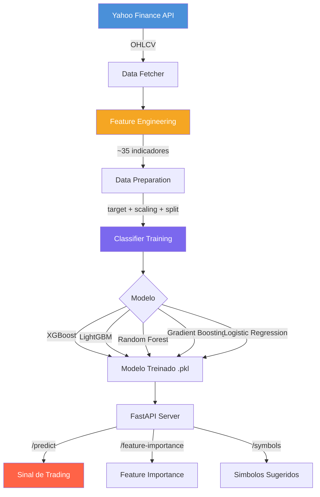
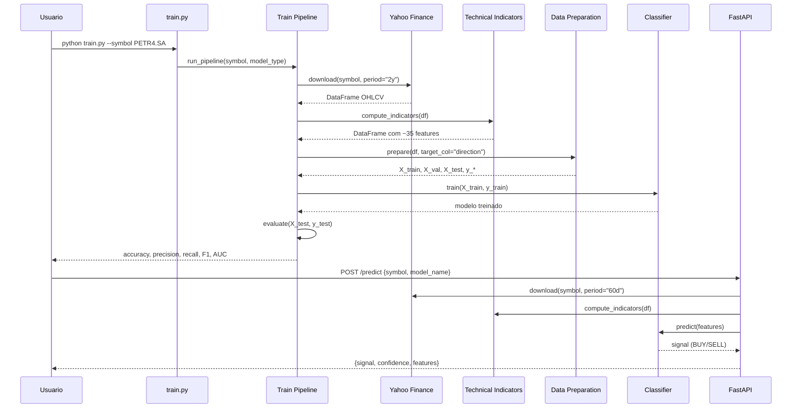
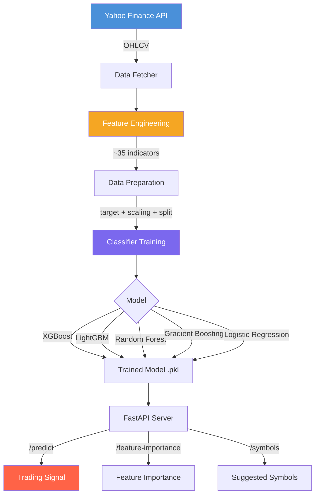
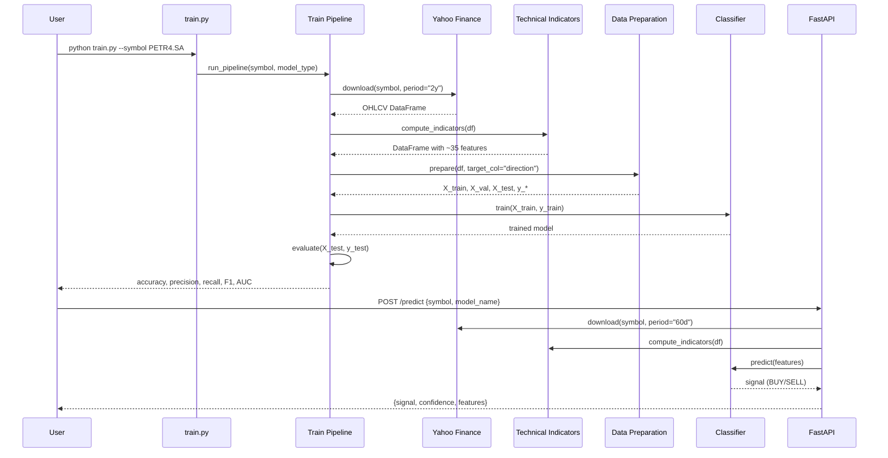

<div align="center">

# ML Trading Signals

[](https://www.python.org/)
[](https://xgboost.readthedocs.io/)
[](https://lightgbm.readthedocs.io/)
[](https://scikit-learn.org/)
[](https://fastapi.tiangolo.com/)
[](Dockerfile)
[](LICENSE)

**Pipeline de machine learning para geracao de sinais de trading a partir de indicadores tecnicos**

**Machine learning pipeline for trading signal generation from technical indicators**

[Portugues](#portugues) | [English](#english)

</div>

---

<a name="portugues"></a>

## Sobre

Sistema completo de machine learning para classificacao de sinais de trading (compra/venda). O pipeline treina classificadores gradient boosting (XGBoost, LightGBM) e modelos classicos (Random Forest, Gradient Boosting, Logistic Regression) sobre dados historicos OHLCV do Yahoo Finance. Calcula aproximadamente 35 indicadores tecnicos usando a biblioteca `ta`, prepara features com escalonamento e divisao temporal, e disponibiliza uma API REST FastAPI para inferencia em tempo real.

O classificador preve se o preco de fechamento subira ou caira no proximo periodo. A variavel-alvo e binaria: `1` (subiu) ou `0` (caiu). Todas as features sao indicadores tecnicos derivados exclusivamente de dados de preco e volume.

> **Nota:** Este e um projeto educacional e demonstrativo. Modelos treinados sobre dados historicos nao garantem performance futura. Nao utilize para decisoes financeiras reais sem validacao adequada e gestao de risco.

## Tecnologias

| Camada | Tecnologia | Finalidade |
|--------|-----------|-----------|
| Linguagem | Python 3.11+ | Core do pipeline |
| Gradient Boosting | XGBoost 2.0, LightGBM 4.1 | Classificadores de alta performance |
| ML Framework | scikit-learn 1.3+ | Random Forest, Logistic Regression, scaling, metricas |
| Indicadores | ta 0.11+ | Calculo de ~35 indicadores tecnicos |
| Dados | yfinance 0.2+ | Download de dados OHLCV de mercado |
| API | FastAPI 0.104+ | Endpoints de inferencia REST |
| Dados | pandas, NumPy | Manipulacao de series temporais |
| Serializacao | joblib | Persistencia de modelos treinados |
| Container | Docker | Empacotamento da API |
| Testes | pytest | Testes unitarios e de integracao |

## Arquitetura


```mermaid
graph TD
    A[Yahoo Finance API] -->|OHLCV| B[Data Fetcher]
    B --> C[Feature Engineering]
    C -->|~35 indicadores| D[Data Preparation]
    D -->|target + scaling + split| E[Classifier Training]
    E --> F{Modelo}
    F -->|XGBoost| G[Modelo Treinado .pkl]
    F -->|LightGBM| G
    F -->|Random Forest| G
    F -->|Gradient Boosting| G
    F -->|Logistic Regression| G
    G --> H[FastAPI Server]
    H -->|/predict| I[Sinal de Trading]
    H -->|/feature-importance| J[Feature Importance]
    H -->|/symbols| K[Simbolos Sugeridos]

    style A fill:#4A90D9,color:#fff
    style C fill:#F5A623,color:#fff
    style E fill:#7B68EE,color:#fff
    style I fill:#FF6347,color:#fff
```

## Fluxo de Processamento


```mermaid
sequenceDiagram
    participant U as Usuario
    participant CLI as train.py
    participant P as Train Pipeline
    participant YF as Yahoo Finance
    participant TI as Technical Indicators
    participant DP as Data Preparation
    participant CLF as Classifier
    participant API as FastAPI

    U->>CLI: python train.py --symbol PETR4.SA
    CLI->>P: run_pipeline(symbol, model_type)
    P->>YF: download(symbol, period="2y")
    YF-->>P: DataFrame OHLCV
    P->>TI: compute_indicators(df)
    TI-->>P: DataFrame com ~35 features
    P->>DP: prepare(df, target_col="direction")
    DP-->>P: X_train, X_val, X_test, y_*
    P->>CLF: train(X_train, y_train)
    CLF-->>P: modelo treinado
    P->>P: evaluate(X_test, y_test)
    P-->>U: accuracy, precision, recall, F1, AUC

    U->>API: POST /predict {symbol, model_name}
    API->>YF: download(symbol, period="60d")
    API->>TI: compute_indicators(df)
    API->>CLF: predict(features)
    CLF-->>API: signal (BUY/SELL)
    API-->>U: {signal, confidence, features}
```

## Estrutura do Projeto

```
ml-trading-signals/
├── train.py                            # Entry point CLI para treinamento (85 LOC)
├── requirements.txt                    # Dependencias de producao
├── requirements-dev.txt                # Dependencias de desenvolvimento/teste
├── Dockerfile                          # Container para API de inferencia
├── pytest.ini                          # Configuracao de testes
├── src/
│   ├── api/
│   │   └── main.py                     # FastAPI: predict, feature-importance, symbols (214 LOC)
│   ├── features/
│   │   ├── technical_indicators.py     # ~35 indicadores tecnicos via lib ta (194 LOC)
│   │   └── data_preparation.py         # Target, scaling, split temporal (208 LOC)
│   ├── models/
│   │   └── classifier.py              # Wrapper unificado para 5 classificadores (231 LOC)
│   └── training/
│       └── train_pipeline.py           # Pipeline: fetch -> features -> prep -> train -> eval (247 LOC)
├── tests/
│   ├── unit/
│   │   ├── test_features.py           # Testes de indicadores e preparacao
│   │   └── test_models.py             # Testes de treinamento, predicao, save/load
│   └── integration/
│       ├── test_api.py                # Testes de endpoints FastAPI
│       └── test_training.py           # Testes end-to-end do pipeline
├── examples/
│   └── predict_signals.py             # Exemplo: sinais com dados simulados
├── notebooks/
│   └── 01_quick_start.md              # Tutorial passo a passo
├── models/                             # Diretorio para modelos salvos (.pkl)
└── data/                               # Diretorios para dados (raw, processed)
```

**Total: ~1.180 linhas de codigo fonte**

## Inicio Rapido

```bash
# Clonar o repositorio
git clone https://github.com/galafis/ml-trading-signals.git
cd ml-trading-signals

# Criar ambiente virtual
python -m venv .venv
source .venv/bin/activate  # Windows: .venv\Scripts\activate

# Instalar dependencias
pip install -r requirements.txt

# Treinar modelo (Bovespa, ultimos 2 anos, XGBoost)
python train.py --symbol ^BVSP --model-type xgboost

# Treinar e salvar modelo
python train.py --symbol PETR4.SA --save-model models/petr4_xgboost.pkl

# Iniciar API de inferencia
uvicorn src.api.main:app --reload
```

### Uso da API

```bash
# Health check
curl http://localhost:8000/health

# Gerar sinal de trading
curl -X POST http://localhost:8000/predict \
  -H "Content-Type: application/json" \
  -d '{"symbol": "PETR4.SA", "model_name": "petr4_xgboost.pkl", "model_type": "xgboost"}'

# Ver feature importance
curl "http://localhost:8000/feature-importance?model_name=petr4_xgboost.pkl&top_n=10"

# Listar simbolos sugeridos
curl http://localhost:8000/symbols
```

### Endpoints da API

| Metodo | Endpoint | Descricao |
|--------|----------|-----------|
| `GET` | `/` | Informacoes da API |
| `GET` | `/health` | Health check |
| `POST` | `/predict` | Gerar sinal de trading para um simbolo |
| `GET` | `/feature-importance` | Feature importance de um modelo salvo |
| `GET` | `/symbols` | Lista de simbolos brasileiros sugeridos |

## Docker

```bash
# Build da imagem
docker build -t ml-trading-signals .

# Executar container
docker run -p 8000:8000 ml-trading-signals
```

## Testes

```bash
# Instalar dependencias de dev
pip install -r requirements-dev.txt

# Rodar testes unitarios
pytest tests/unit/ -v

# Rodar todos os testes (inclui integracao com yfinance)
pytest -v

# Com cobertura
pytest --cov=src --cov-report=term-missing
```

## Benchmarks

| Operacao | Volume | Tempo |
|----------|--------|-------|
| Download OHLCV (2 anos) | ~500 candles | < 3 s |
| Feature engineering (~35 indicadores) | 500 candles | < 100 ms |
| Data preparation (scaling + split) | 500 amostras | < 50 ms |
| Treinamento XGBoost | 350 amostras / 35 features | < 2 s |
| Treinamento LightGBM | 350 amostras / 35 features | < 1 s |
| Inferencia (predicao unica) | 1 amostra | < 5 ms |
| API /predict (end-to-end com download) | 1 simbolo | < 5 s |

## Indicadores Tecnicos

| Categoria | Indicadores |
|-----------|------------|
| Tendencia | SMA (5, 10, 20, 50), EMA (5, 10, 20), MACD, ADX |
| Momentum | RSI, Stochastic Oscillator, Williams %R, ROC |
| Volatilidade | Bollinger Bands, ATR, Keltner Channel |
| Volume | OBV, Volume SMA 20, MFI, VPT |
| Preco | Returns, Log Returns, Price Change, High-Low Range, Gap |

## Modelos Disponiveis

| Modelo | Biblioteca | Tipo |
|--------|-----------|------|
| XGBoost | `xgboost` | Gradient Boosting |
| LightGBM | `lightgbm` | Gradient Boosting |
| Random Forest | `scikit-learn` | Ensemble |
| Gradient Boosting | `scikit-learn` | Gradient Boosting |
| Logistic Regression | `scikit-learn` | Linear |

## Aplicabilidade na Industria

| Setor | Caso de Uso | Componentes |
|-------|-------------|-------------|
| **Gestao de Ativos** | Sinais quantitativos para selecao de portfolio em acoes brasileiras (B3) | Feature Engineering, XGBoost |
| **Fundos Quantitativos** | Backtesting de estrategias sistematicas com indicadores tecnicos | Train Pipeline, Classifier |
| **Trading Algoritmico** | API de inferencia em tempo real para execucao automatizada | FastAPI, Model Serving |
| **Educacao Financeira** | Demonstracao de pipelines ML aplicados a mercado financeiro | Notebooks, Examples |
| **Research** | Comparacao de modelos de classificacao para predicao de direcao de preco | Multi-model Training, Evaluation |
| **Fintechs** | Modulo de sinais tecnicos integravel a plataformas de investimento | API REST, Docker |

---

<a name="english"></a>

## About

A complete machine learning system for trading signal classification (buy/sell). The pipeline trains gradient boosting classifiers (XGBoost, LightGBM) and classical models (Random Forest, Gradient Boosting, Logistic Regression) on historical OHLCV data from Yahoo Finance. It computes approximately 35 technical indicators using the `ta` library, prepares features with scaling and temporal splitting, and serves a FastAPI REST endpoint for real-time inference.

The classifier predicts whether the closing price will rise or fall in the next period. The target variable is binary: `1` (up) or `0` (down). All features are technical indicators derived exclusively from price and volume data.

> **Note:** This is an educational and demonstration project. Models trained on historical data do not guarantee future performance. Do not use for real financial decisions without proper validation and risk management.

## Technologies

| Layer | Technology | Purpose |
|-------|-----------|---------|
| Language | Python 3.11+ | Pipeline core |
| Gradient Boosting | XGBoost 2.0, LightGBM 4.1 | High-performance classifiers |
| ML Framework | scikit-learn 1.3+ | Random Forest, Logistic Regression, scaling, metrics |
| Indicators | ta 0.11+ | ~35 technical indicator computation |
| Data | yfinance 0.2+ | OHLCV market data download |
| API | FastAPI 0.104+ | REST inference endpoints |
| Data | pandas, NumPy | Time series manipulation |
| Serialization | joblib | Trained model persistence |
| Container | Docker | API packaging |
| Testing | pytest | Unit and integration tests |

## Architecture


```mermaid
graph TD
    A[Yahoo Finance API] -->|OHLCV| B[Data Fetcher]
    B --> C[Feature Engineering]
    C -->|~35 indicators| D[Data Preparation]
    D -->|target + scaling + split| E[Classifier Training]
    E --> F{Model}
    F -->|XGBoost| G[Trained Model .pkl]
    F -->|LightGBM| G
    F -->|Random Forest| G
    F -->|Gradient Boosting| G
    F -->|Logistic Regression| G
    G --> H[FastAPI Server]
    H -->|/predict| I[Trading Signal]
    H -->|/feature-importance| J[Feature Importance]
    H -->|/symbols| K[Suggested Symbols]

    style A fill:#4A90D9,color:#fff
    style C fill:#F5A623,color:#fff
    style E fill:#7B68EE,color:#fff
    style I fill:#FF6347,color:#fff
```

## Processing Flow


```mermaid
sequenceDiagram
    participant U as User
    participant CLI as train.py
    participant P as Train Pipeline
    participant YF as Yahoo Finance
    participant TI as Technical Indicators
    participant DP as Data Preparation
    participant CLF as Classifier
    participant API as FastAPI

    U->>CLI: python train.py --symbol PETR4.SA
    CLI->>P: run_pipeline(symbol, model_type)
    P->>YF: download(symbol, period="2y")
    YF-->>P: OHLCV DataFrame
    P->>TI: compute_indicators(df)
    TI-->>P: DataFrame with ~35 features
    P->>DP: prepare(df, target_col="direction")
    DP-->>P: X_train, X_val, X_test, y_*
    P->>CLF: train(X_train, y_train)
    CLF-->>P: trained model
    P->>P: evaluate(X_test, y_test)
    P-->>U: accuracy, precision, recall, F1, AUC

    U->>API: POST /predict {symbol, model_name}
    API->>YF: download(symbol, period="60d")
    API->>TI: compute_indicators(df)
    API->>CLF: predict(features)
    CLF-->>API: signal (BUY/SELL)
    API-->>U: {signal, confidence, features}
```

## Project Structure

```
ml-trading-signals/
├── train.py                            # CLI entry point for training (85 LOC)
├── requirements.txt                    # Production dependencies
├── requirements-dev.txt                # Dev/test dependencies
├── Dockerfile                          # Container for inference API
├── pytest.ini                          # Test configuration
├── src/
│   ├── api/
│   │   └── main.py                     # FastAPI: predict, feature-importance, symbols (214 LOC)
│   ├── features/
│   │   ├── technical_indicators.py     # ~35 technical indicators via ta lib (194 LOC)
│   │   └── data_preparation.py         # Target, scaling, time-aware split (208 LOC)
│   ├── models/
│   │   └── classifier.py              # Unified wrapper for 5 classifiers (231 LOC)
│   └── training/
│       └── train_pipeline.py           # Pipeline: fetch -> features -> prep -> train -> eval (247 LOC)
├── tests/
│   ├── unit/
│   │   ├── test_features.py           # Indicator and preparation tests
│   │   └── test_models.py             # Training, prediction, save/load tests
│   └── integration/
│       ├── test_api.py                # FastAPI endpoint tests
│       └── test_training.py           # End-to-end pipeline tests
├── examples/
│   └── predict_signals.py             # Example: signals with simulated data
├── notebooks/
│   └── 01_quick_start.md              # Step-by-step tutorial
├── models/                             # Directory for saved models (.pkl)
└── data/                               # Data directories (raw, processed)
```

**Total: ~1,180 lines of source code**

## Quick Start

```bash
# Clone the repository
git clone https://github.com/galafis/ml-trading-signals.git
cd ml-trading-signals

# Create virtual environment
python -m venv .venv
source .venv/bin/activate  # Windows: .venv\Scripts\activate

# Install dependencies
pip install -r requirements.txt

# Train a model (Bovespa index, last 2 years, XGBoost)
python train.py --symbol ^BVSP --model-type xgboost

# Train and save model
python train.py --symbol PETR4.SA --save-model models/petr4_xgboost.pkl

# Start inference API
uvicorn src.api.main:app --reload
```

### API Usage

```bash
# Health check
curl http://localhost:8000/health

# Generate trading signal
curl -X POST http://localhost:8000/predict \
  -H "Content-Type: application/json" \
  -d '{"symbol": "PETR4.SA", "model_name": "petr4_xgboost.pkl", "model_type": "xgboost"}'

# View feature importance
curl "http://localhost:8000/feature-importance?model_name=petr4_xgboost.pkl&top_n=10"

# List suggested symbols
curl http://localhost:8000/symbols
```

### API Endpoints

| Method | Endpoint | Description |
|--------|----------|-------------|
| `GET` | `/` | API info |
| `GET` | `/health` | Health check |
| `POST` | `/predict` | Generate trading signal for a symbol |
| `GET` | `/feature-importance` | Feature importance from a saved model |
| `GET` | `/symbols` | List suggested Brazilian stock symbols |

## Docker

```bash
# Build image
docker build -t ml-trading-signals .

# Run container
docker run -p 8000:8000 ml-trading-signals
```

## Tests

```bash
# Install dev dependencies
pip install -r requirements-dev.txt

# Run unit tests
pytest tests/unit/ -v

# Run all tests (includes integration with yfinance)
pytest -v

# With coverage
pytest --cov=src --cov-report=term-missing
```

## Benchmarks

| Operation | Volume | Time |
|-----------|--------|------|
| OHLCV download (2 years) | ~500 candles | < 3 s |
| Feature engineering (~35 indicators) | 500 candles | < 100 ms |
| Data preparation (scaling + split) | 500 samples | < 50 ms |
| XGBoost training | 350 samples / 35 features | < 2 s |
| LightGBM training | 350 samples / 35 features | < 1 s |
| Inference (single prediction) | 1 sample | < 5 ms |
| API /predict (end-to-end with download) | 1 symbol | < 5 s |

## Technical Indicators

| Category | Indicators |
|----------|-----------|
| Trend | SMA (5, 10, 20, 50), EMA (5, 10, 20), MACD, ADX |
| Momentum | RSI, Stochastic Oscillator, Williams %R, ROC |
| Volatility | Bollinger Bands, ATR, Keltner Channel |
| Volume | OBV, Volume SMA 20, MFI, VPT |
| Price | Returns, Log Returns, Price Change, High-Low Range, Gap |

## Available Models

| Model | Library | Type |
|-------|---------|------|
| XGBoost | `xgboost` | Gradient Boosting |
| LightGBM | `lightgbm` | Gradient Boosting |
| Random Forest | `scikit-learn` | Ensemble |
| Gradient Boosting | `scikit-learn` | Gradient Boosting |
| Logistic Regression | `scikit-learn` | Linear |

## Industry Applications

| Sector | Use Case | Components |
|--------|----------|------------|
| **Asset Management** | Quantitative signals for Brazilian stock portfolio selection (B3) | Feature Engineering, XGBoost |
| **Quant Funds** | Systematic strategy backtesting with technical indicators | Train Pipeline, Classifier |
| **Algorithmic Trading** | Real-time inference API for automated execution | FastAPI, Model Serving |
| **Financial Education** | ML pipeline demonstration applied to financial markets | Notebooks, Examples |
| **Research** | Classification model comparison for price direction prediction | Multi-model Training, Evaluation |
| **Fintechs** | Technical signal module integrable with investment platforms | REST API, Docker |

---

## Autor / Author

**Gabriel Demetrios Lafis**

- GitHub: [@galafis](https://github.com/galafis)
- LinkedIn: [Gabriel Demetrios Lafis](https://linkedin.com/in/gabriel-demetrios-lafis)

## Licenca / License

Este projeto esta licenciado sob a Licenca MIT - veja o arquivo [LICENSE](LICENSE) para detalhes.

This project is licensed under the MIT License - see the [LICENSE](LICENSE) file for details.
