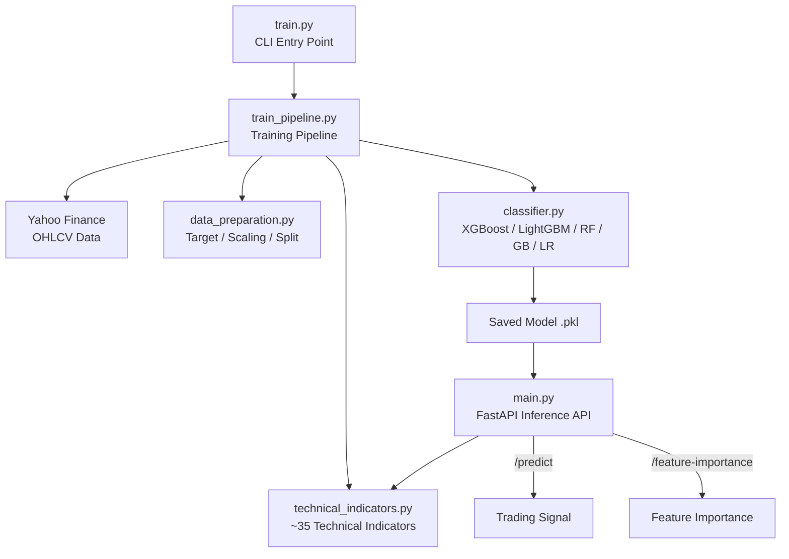

# ML Trading Signals

Sistema de machine learning para gerar sinais de trading (compra/venda) a partir de indicadores tecnicos. Utiliza classificadores como XGBoost e LightGBM treinados sobre dados historicos do Yahoo Finance.

[](https://python.org)
[](https://xgboost.readthedocs.io)
[](https://lightgbm.readthedocs.io)
[](https://fastapi.tiangolo.com)
[](LICENSE)

[Portugues](#portugues) | [English](#english)

---

## Portugues

### Visao Geral

Este projeto implementa um pipeline completo de machine learning para classificacao de sinais de trading:

1. **Coleta de dados** -- baixa OHLCV historico via `yfinance`
2. **Feature engineering** -- calcula ~35 indicadores tecnicos (SMA, EMA, MACD, RSI, Bollinger Bands, ATR, OBV, etc.) usando a biblioteca `ta`
3. **Preparacao** -- cria variavel-alvo (direcao do preco), trata valores ausentes/infinitos, escala features com `StandardScaler`, divide em train/val/test respeitando ordem temporal
4. **Treinamento** -- treina classificador binario (XGBoost, LightGBM, Random Forest, Gradient Boosting ou Logistic Regression)
5. **Avaliacao** -- calcula accuracy, precision, recall, F1 e AUC no conjunto de teste
6. **Inferencia** -- API FastAPI que carrega modelo salvo e retorna sinais para um simbolo

### Como Funciona

O pipeline treina um classificador para prever se o preco de fechamento subira ou cairá no proximo periodo. A variavel-alvo e binaria: `1` (subiu) ou `0` (caiu). Todas as features sao indicadores tecnicos calculados a partir de dados OHLCV.

> **Nota:** Este e um projeto educacional/demonstrativo. Os modelos treinados sobre dados historicos nao garantem performance futura. Nao utilize para decisoes financeiras reais sem validacao adequada.

### Inicio Rapido

```bash
# Clonar o repositorio
git clone https://github.com/galafis/ml-trading-signals.git
cd ml-trading-signals

# Criar ambiente virtual e instalar dependencias
python -m venv venv
source venv/bin/activate  # Windows: venv\Scripts\activate
pip install -r requirements.txt

# Treinar modelo (Bovespa, ultimos 2 anos, XGBoost)
python train.py --symbol ^BVSP --model-type xgboost

# Treinar e salvar modelo
python train.py --symbol PETR4.SA --save-model models/petr4_xgboost.pkl

# Iniciar API de inferencia
uvicorn src.api.main:app --reload
```

### Uso da API

```bash
# Health check
curl http://localhost:8000/health

# Gerar sinal de trading
curl -X POST http://localhost:8000/predict \
  -H "Content-Type: application/json" \
  -d '{"symbol": "PETR4.SA", "model_name": "petr4_xgboost.pkl", "model_type": "xgboost"}'

# Ver feature importance do modelo
curl "http://localhost:8000/feature-importance?model_name=petr4_xgboost.pkl&top_n=10"

# Listar simbolos sugeridos
curl http://localhost:8000/symbols
```

### Estrutura do Projeto


```mermaid
graph TD
    CLI["train.py<br/>CLI Entry Point"] --> PIPE["train_pipeline.py<br/>Training Pipeline"]
    PIPE --> YFINANCE["Yahoo Finance<br/>OHLCV Data"]
    PIPE --> TI["technical_indicators.py<br/>~35 Technical Indicators"]
    PIPE --> DP["data_preparation.py<br/>Target / Scaling / Split"]
    PIPE --> CLF["classifier.py<br/>XGBoost / LightGBM / RF / GB / LR"]
    CLF --> SAVED["Saved Model .pkl"]
    SAVED --> API["main.py<br/>FastAPI Inference API"]
    API --> TI
    API -->|"/predict"| SIGNAL["Trading Signal"]
    API -->|"/feature-importance"| FI["Feature Importance"]
```

```
ml-trading-signals/
├── src/
│   ├── api/
│   │   └── main.py                 # API FastAPI (predict, feature-importance, symbols)
│   ├── features/
│   │   ├── technical_indicators.py # ~35 indicadores tecnicos via lib ta
│   │   └── data_preparation.py     # Criacao de target, scaling, split temporal
│   ├── models/
│   │   └── classifier.py           # Wrapper unificado para 5 classificadores
│   └── training/
│       └── train_pipeline.py       # Pipeline: fetch -> features -> prep -> train -> eval
├── tests/
│   ├── unit/
│   │   ├── test_features.py        # Testes de indicadores e preparacao de dados
│   │   └── test_models.py          # Testes de treinamento, predicao, save/load
│   └── integration/
│       ├── test_api.py             # Testes de endpoints FastAPI
│       └── test_training.py        # Testes end-to-end do pipeline
├── examples/
│   └── predict_signals.py          # Exemplo: gerar sinais com dados simulados
├── notebooks/
│   └── 01_quick_start.md           # Tutorial passo a passo (convertivel para .ipynb)
├── models/                         # Diretorio para modelos salvos (.pkl)
├── data/                           # Diretorios para dados (raw, processed, external)
├── train.py                        # Entry point CLI para treinamento
├── requirements.txt                # Dependencias de producao
├── requirements-dev.txt            # Dependencias de desenvolvimento/teste
├── Dockerfile                      # Container para API
└── pytest.ini                      # Configuracao de testes
```

### Indicadores Tecnicos Implementados

| Categoria | Indicadores |
|-----------|------------|
| Tendencia | SMA (5, 10, 20, 50), EMA (5, 10, 20), MACD, ADX |
| Momentum | RSI, Stochastic Oscillator, Williams %R, ROC |
| Volatilidade | Bollinger Bands, ATR, Keltner Channel |
| Volume | OBV, Volume SMA 20, MFI, VPT |
| Preco | Returns, Log Returns, Price Change, High-Low Range, Gap |

### Modelos Disponiveis

| Modelo | Biblioteca |
|--------|-----------|
| XGBoost | `xgboost` |
| LightGBM | `lightgbm` |
| Random Forest | `scikit-learn` |
| Gradient Boosting | `scikit-learn` |
| Logistic Regression | `scikit-learn` |

### Testes

```bash
# Instalar dependencias de dev
pip install -r requirements-dev.txt

# Rodar testes unitarios
pytest tests/unit/ -v

# Rodar todos os testes (inclui integracao com yfinance)
pytest -v

# Com cobertura
pytest --cov=src --cov-report=term-missing
```

### Docker

```bash
docker build -t ml-trading-signals .
docker run -p 8000:8000 ml-trading-signals
```

### Stack

| Tecnologia | Uso |
|------------|-----|
| Python 3.11+ | Linguagem principal |
| XGBoost / LightGBM | Classificadores gradient boosting |
| scikit-learn | Random Forest, Logistic Regression, scaling, metricas |
| ta | Calculo de indicadores tecnicos |
| yfinance | Download de dados de mercado |
| FastAPI | API de inferencia |
| pandas / numpy | Manipulacao de dados |
| joblib | Serializacao de modelos |
| MLflow (opcional) | Tracking de experimentos |

---

## English

### Overview

This project implements a complete machine learning pipeline for trading signal classification:

1. **Data collection** -- downloads historical OHLCV data via `yfinance`
2. **Feature engineering** -- computes ~35 technical indicators (SMA, EMA, MACD, RSI, Bollinger Bands, ATR, OBV, etc.) using the `ta` library
3. **Preparation** -- creates target variable (price direction), handles missing/infinite values, scales features with `StandardScaler`, splits into train/val/test respecting time order
4. **Training** -- trains a binary classifier (XGBoost, LightGBM, Random Forest, Gradient Boosting, or Logistic Regression)
5. **Evaluation** -- computes accuracy, precision, recall, F1, and AUC on the test set
6. **Inference** -- FastAPI endpoint that loads a saved model and returns signals for a given symbol

### How It Works

The pipeline trains a classifier to predict whether the closing price will rise or fall in the next period. The target variable is binary: `1` (up) or `0` (down). All features are technical indicators computed from OHLCV data.

> **Note:** This is an educational/demonstration project. Models trained on historical data do not guarantee future performance. Do not use for real financial decisions without proper validation.

### Quick Start

```bash
# Clone the repository
git clone https://github.com/galafis/ml-trading-signals.git
cd ml-trading-signals

# Create virtual environment and install dependencies
python -m venv venv
source venv/bin/activate  # Windows: venv\Scripts\activate
pip install -r requirements.txt

# Train a model (Bovespa index, last 2 years, XGBoost)
python train.py --symbol ^BVSP --model-type xgboost

# Train and save model
python train.py --symbol PETR4.SA --save-model models/petr4_xgboost.pkl

# Start inference API
uvicorn src.api.main:app --reload
```

### API Usage

```bash
# Health check
curl http://localhost:8000/health

# Generate trading signal
curl -X POST http://localhost:8000/predict \
  -H "Content-Type: application/json" \
  -d '{"symbol": "PETR4.SA", "model_name": "petr4_xgboost.pkl", "model_type": "xgboost"}'

# View model feature importance
curl "http://localhost:8000/feature-importance?model_name=petr4_xgboost.pkl&top_n=10"

# List suggested symbols
curl http://localhost:8000/symbols
```

### API Endpoints

| Method | Endpoint | Description |
|--------|----------|-------------|
| `GET` | `/` | API info |
| `GET` | `/health` | Health check |
| `POST` | `/predict` | Generate trading signal for a symbol |
| `GET` | `/feature-importance` | Get feature importance from a saved model |
| `GET` | `/symbols` | List suggested Brazilian stock symbols |

### Project Structure


```mermaid
graph TD
    CLI["train.py<br/>CLI Entry Point"] --> PIPE["train_pipeline.py<br/>Training Pipeline"]
    PIPE --> YFINANCE["Yahoo Finance<br/>OHLCV Data"]
    PIPE --> TI["technical_indicators.py<br/>~35 Technical Indicators"]
    PIPE --> DP["data_preparation.py<br/>Target / Scaling / Split"]
    PIPE --> CLF["classifier.py<br/>XGBoost / LightGBM / RF / GB / LR"]
    CLF --> SAVED["Saved Model .pkl"]
    SAVED --> API["main.py<br/>FastAPI Inference API"]
    API --> TI
    API -->|"/predict"| SIGNAL["Trading Signal"]
    API -->|"/feature-importance"| FI["Feature Importance"]
```

```
ml-trading-signals/
├── src/
│   ├── api/
│   │   └── main.py                 # FastAPI app (predict, feature-importance, symbols)
│   ├── features/
│   │   ├── technical_indicators.py # ~35 technical indicators via ta lib
│   │   └── data_preparation.py     # Target creation, scaling, time-aware split
│   ├── models/
│   │   └── classifier.py           # Unified wrapper for 5 classifiers
│   └── training/
│       └── train_pipeline.py       # Pipeline: fetch -> features -> prep -> train -> eval
├── tests/
│   ├── unit/                       # Feature and model unit tests
│   └── integration/                # API and pipeline integration tests
├── examples/
│   └── predict_signals.py          # Example: generate signals with simulated data
├── notebooks/
│   └── 01_quick_start.md           # Step-by-step tutorial (convertible to .ipynb)
├── train.py                        # CLI entry point for training
├── requirements.txt                # Production dependencies
├── requirements-dev.txt            # Dev/test dependencies
├── Dockerfile                      # Container for API
└── pytest.ini                      # Test configuration
```

### Available Models

| Model | Library |
|-------|---------|
| XGBoost | `xgboost` |
| LightGBM | `lightgbm` |
| Random Forest | `scikit-learn` |
| Gradient Boosting | `scikit-learn` |
| Logistic Regression | `scikit-learn` |

### Tests

```bash
# Install dev dependencies
pip install -r requirements-dev.txt

# Run unit tests
pytest tests/unit/ -v

# Run all tests (includes integration with yfinance)
pytest -v

# With coverage
pytest --cov=src --cov-report=term-missing
```

### Docker

```bash
docker build -t ml-trading-signals .
docker run -p 8000:8000 ml-trading-signals
```

### Tech Stack

| Technology | Usage |
|------------|-------|
| Python 3.11+ | Primary language |
| XGBoost / LightGBM | Gradient boosting classifiers |
| scikit-learn | Random Forest, Logistic Regression, scaling, metrics |
| ta | Technical indicator computation |
| yfinance | Market data download |
| FastAPI | Inference API |
| pandas / numpy | Data manipulation |
| joblib | Model serialization |
| MLflow (optional) | Experiment tracking |

---

## Autor / Author

**Gabriel Demetrios Lafis**
- GitHub: [@galafis](https://github.com/galafis)
- LinkedIn: [Gabriel Demetrios Lafis](https://linkedin.com/in/gabriel-demetrios-lafis)

## Licenca / License

MIT License - veja [LICENSE](LICENSE) para detalhes.
