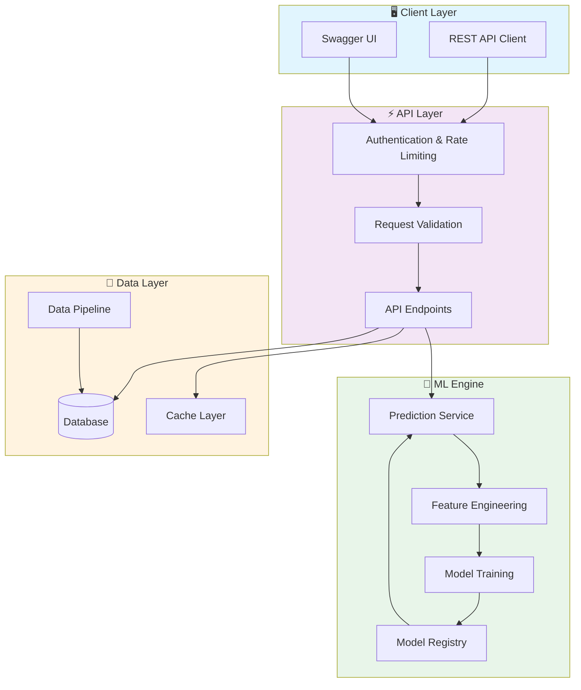
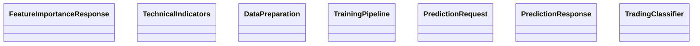

# 📈 Ml Trading Signals

> Machine learning system for generating trading signals using XGBoost, LightGBM, and ensemble methods. Features 40+ technical indicators, MLflow tracking, and FastAPI inference API.

[](https://img.shields.io/badge/)
[](https://img.shields.io/badge/)
[](https://img.shields.io/badge/)
[](https://img.shields.io/badge/)
[](https://img.shields.io/badge/)
[](https://img.shields.io/badge/)
[](https://img.shields.io/badge/)
[](https://img.shields.io/badge/)
[](https://img.shields.io/badge/)
[](LICENSE)

[English](#english) | [Português](#português)

---

## English

### 🎯 Overview

**Ml Trading Signals** is a production-grade Python application that showcases modern software engineering practices including clean architecture, comprehensive testing, containerized deployment, and CI/CD readiness.

The codebase comprises **2,204 lines** of source code organized across **22 modules**, following industry best practices for maintainability, scalability, and code quality.

### ✨ Key Features

- **📈 Strategy Engine**: Multiple trading strategy implementations with configurable parameters
- **🔄 Backtesting Framework**: Historical data simulation with realistic market conditions
- **📊 Performance Analytics**: Sharpe ratio, Sortino ratio, maximum drawdown, and more
- **⚡ Real-time Processing**: Low-latency data processing optimized for market speed
- **🤖 ML Pipeline**: End-to-end machine learning workflow from data to deployment
- **🔬 Feature Engineering**: Automated feature extraction and transformation
- **📊 Model Evaluation**: Comprehensive metrics and cross-validation
- **🚀 Model Serving**: Production-ready prediction API

### 🏗️ Architecture


```mermaid
graph TB
    subgraph Client["🖥️ Client Layer"]
        A[REST API Client]
        B[Swagger UI]
    end
    
    subgraph API["⚡ API Layer"]
        C[Authentication & Rate Limiting]
        D[Request Validation]
        E[API Endpoints]
    end
    
    subgraph ML["🤖 ML Engine"]
        F[Feature Engineering]
        G[Model Training]
        H[Prediction Service]
        I[Model Registry]
    end
    
    subgraph Data["💾 Data Layer"]
        J[(Database)]
        K[Cache Layer]
        L[Data Pipeline]
    end
    
    A --> C
    B --> C
    C --> D --> E
    E --> H
    E --> J
    H --> F --> G
    G --> I
    I --> H
    E --> K
    L --> J
    
    style Client fill:#e1f5fe
    style API fill:#f3e5f5
    style ML fill:#e8f5e9
    style Data fill:#fff3e0
```


```mermaid
classDiagram
    class FeatureImportanceResponse
    class TechnicalIndicators
    class DataPreparation
    class TrainingPipeline
    class PredictionRequest
    class PredictionResponse
    class TradingClassifier
```

### 📡 API Endpoints

| Method | Endpoint | Description |
|--------|----------|-------------|
| `GET` | `/` | Retrieve resource (list/create) |
| `GET` | `/health` | Retrieve Health |
| `POST` | `/predict` | Create Predict |
| `GET` | `/feature-importance` | Retrieve Feature-Importance |
| `GET` | `/symbols` | Retrieve Symbols |

### 🚀 Quick Start

#### Prerequisites

- Python 3.12+
- pip (Python package manager)
- Docker and Docker Compose (optional)

#### Installation

```bash
# Clone the repository
git clone https://github.com/galafis/ml-trading-signals.git
cd ml-trading-signals

# Create and activate virtual environment
python -m venv venv
source venv/bin/activate  # On Windows: venv\Scripts\activate

# Install dependencies
pip install -r requirements.txt
```

#### Running

```bash
# Run the application
python src/api/main.py
```

### 🐳 Docker

```bash
# Build the Docker image
docker build -t ml-trading-signals .

# Run the container
docker run -d -p 8000:8000 --name ml-trading-signals ml-trading-signals

# View logs
docker logs -f ml-trading-signals

# Stop and remove
docker stop ml-trading-signals && docker rm ml-trading-signals
```

### 🧪 Testing

```bash
# Run all tests
pytest

# Run with coverage report
pytest --cov --cov-report=html

# Run specific test module
pytest tests/test_main.py -v

# Run with detailed output
pytest -v --tb=short
```

### 📁 Project Structure

```
ml-trading-signals/
├── data/
│   ├── external/
│   ├── processed/
│   └── raw/
├── docs/          # Documentation
│   └── images/
├── examples/
│   └── predict_signals.py
├── models/        # Data models
│   └── README.md
├── notebooks/
│   ├── 01_quick_start.md
│   └── README.md
├── scripts/
│   └── generate_charts.py
├── src/          # Source code
│   ├── api/           # API endpoints
│   │   ├── __init__.py
│   │   └── main.py
│   ├── features/
│   │   ├── __init__.py
│   │   ├── data_preparation.py
│   │   └── technical_indicators.py
│   ├── inference/
│   │   └── __init__.py
│   ├── models/        # Data models
│   │   ├── __init__.py
│   │   └── classifier.py
│   ├── training/
│   │   ├── __init__.py
│   │   └── train_pipeline.py
│   ├── utils/         # Utilities
│   │   └── __init__.py
│   └── __init__.py
├── tests/         # Test suite
│   ├── integration/
│   │   ├── __init__.py
│   │   ├── test_api.py
│   │   └── test_training.py
│   ├── unit/
│   │   ├── __init__.py
│   │   ├── test_features.py
│   │   └── test_models.py
│   └── __init__.py
├── CONTRIBUTING.md
├── Dockerfile
├── LICENSE
├── README.md
├── requirements.txt
└── train.py
```

### 📊 Performance Metrics

The engine calculates comprehensive performance metrics:

| Metric | Description | Formula |
|--------|-------------|---------|
| **Sharpe Ratio** | Risk-adjusted return | (Rp - Rf) / σp |
| **Sortino Ratio** | Downside risk-adjusted return | (Rp - Rf) / σd |
| **Max Drawdown** | Maximum peak-to-trough decline | max(1 - Pt/Pmax) |
| **Win Rate** | Percentage of profitable trades | Wins / Total |
| **Profit Factor** | Gross profit / Gross loss | ΣProfit / ΣLoss |
| **Calmar Ratio** | Return / Max Drawdown | CAGR / MDD |
| **VaR (95%)** | Value at Risk | 5th percentile of returns |
| **Expected Shortfall** | Conditional VaR | E[R | R < VaR] |

### 🛠️ Tech Stack

| Technology | Description | Role |
|------------|-------------|------|
| **Python** | Core Language | Primary |
| **Docker** | Containerization platform | Framework |
| **FastAPI** | High-performance async web framework | Framework |
| **MLflow** | ML lifecycle management | Framework |
| **NumPy** | Numerical computing | Framework |
| **Pandas** | Data manipulation library | Framework |
| **Plotly** | Interactive visualization | Framework |
| **scikit-learn** | Machine learning library | Framework |
| **XGBoost** | Gradient boosting framework | Framework |

### 🚀 Deployment

#### Cloud Deployment Options

The application is containerized and ready for deployment on:

| Platform | Service | Notes |
|----------|---------|-------|
| **AWS** | ECS, EKS, EC2 | Full container support |
| **Google Cloud** | Cloud Run, GKE | Serverless option available |
| **Azure** | Container Instances, AKS | Enterprise integration |
| **DigitalOcean** | App Platform, Droplets | Cost-effective option |

```bash
# Production build
docker build -t ml-trading-signals:latest .

# Tag for registry
docker tag ml-trading-signals:latest registry.example.com/ml-trading-signals:latest

# Push to registry
docker push registry.example.com/ml-trading-signals:latest
```

### 🤝 Contributing

Contributions are welcome! Please feel free to submit a Pull Request. For major changes, please open an issue first to discuss what you would like to change.

1. Fork the project
2. Create your feature branch (`git checkout -b feature/AmazingFeature`)
3. Commit your changes (`git commit -m 'Add some AmazingFeature'`)
4. Push to the branch (`git push origin feature/AmazingFeature`)
5. Open a Pull Request

### 📄 License

This project is licensed under the MIT License - see the [LICENSE](LICENSE) file for details.

### 👤 Author

**Gabriel Demetrios Lafis**
- GitHub: [@galafis](https://github.com/galafis)
- LinkedIn: [Gabriel Demetrios Lafis](https://linkedin.com/in/gabriel-demetrios-lafis)

---

## Português

### 🎯 Visão Geral

**Ml Trading Signals** é uma aplicação Python de nível profissional que demonstra práticas modernas de engenharia de software, incluindo arquitetura limpa, testes abrangentes, implantação containerizada e prontidão para CI/CD.

A base de código compreende **2,204 linhas** de código-fonte organizadas em **22 módulos**, seguindo as melhores práticas do setor para manutenibilidade, escalabilidade e qualidade de código.

### ✨ Funcionalidades Principais

- **📈 Strategy Engine**: Multiple trading strategy implementations with configurable parameters
- **🔄 Backtesting Framework**: Historical data simulation with realistic market conditions
- **📊 Performance Analytics**: Sharpe ratio, Sortino ratio, maximum drawdown, and more
- **⚡ Real-time Processing**: Low-latency data processing optimized for market speed
- **🤖 ML Pipeline**: End-to-end machine learning workflow from data to deployment
- **🔬 Feature Engineering**: Automated feature extraction and transformation
- **📊 Model Evaluation**: Comprehensive metrics and cross-validation
- **🚀 Model Serving**: Production-ready prediction API

### 🏗️ Arquitetura


```mermaid
graph TB
    subgraph Client["🖥️ Client Layer"]
        A[REST API Client]
        B[Swagger UI]
    end
    
    subgraph API["⚡ API Layer"]
        C[Authentication & Rate Limiting]
        D[Request Validation]
        E[API Endpoints]
    end
    
    subgraph ML["🤖 ML Engine"]
        F[Feature Engineering]
        G[Model Training]
        H[Prediction Service]
        I[Model Registry]
    end
    
    subgraph Data["💾 Data Layer"]
        J[(Database)]
        K[Cache Layer]
        L[Data Pipeline]
    end
    
    A --> C
    B --> C
    C --> D --> E
    E --> H
    E --> J
    H --> F --> G
    G --> I
    I --> H
    E --> K
    L --> J
    
    style Client fill:#e1f5fe
    style API fill:#f3e5f5
    style ML fill:#e8f5e9
    style Data fill:#fff3e0
```

### 📡 API Endpoints

| Method | Endpoint | Description |
|--------|----------|-------------|
| `GET` | `/` | Retrieve resource (list/create) |
| `GET` | `/health` | Retrieve Health |
| `POST` | `/predict` | Create Predict |
| `GET` | `/feature-importance` | Retrieve Feature-Importance |
| `GET` | `/symbols` | Retrieve Symbols |

### 🚀 Início Rápido

#### Prerequisites

- Python 3.12+
- pip (Python package manager)
- Docker and Docker Compose (optional)

#### Installation

```bash
# Clone the repository
git clone https://github.com/galafis/ml-trading-signals.git
cd ml-trading-signals

# Create and activate virtual environment
python -m venv venv
source venv/bin/activate  # On Windows: venv\Scripts\activate

# Install dependencies
pip install -r requirements.txt
```

#### Running

```bash
# Run the application
python src/api/main.py
```

### 🐳 Docker

```bash
# Build the Docker image
docker build -t ml-trading-signals .

# Run the container
docker run -d -p 8000:8000 --name ml-trading-signals ml-trading-signals

# View logs
docker logs -f ml-trading-signals

# Stop and remove
docker stop ml-trading-signals && docker rm ml-trading-signals
```

### 🧪 Testing

```bash
# Run all tests
pytest

# Run with coverage report
pytest --cov --cov-report=html

# Run specific test module
pytest tests/test_main.py -v

# Run with detailed output
pytest -v --tb=short
```

### 📁 Estrutura do Projeto

```
ml-trading-signals/
├── data/
│   ├── external/
│   ├── processed/
│   └── raw/
├── docs/          # Documentation
│   └── images/
├── examples/
│   └── predict_signals.py
├── models/        # Data models
│   └── README.md
├── notebooks/
│   ├── 01_quick_start.md
│   └── README.md
├── scripts/
│   └── generate_charts.py
├── src/          # Source code
│   ├── api/           # API endpoints
│   │   ├── __init__.py
│   │   └── main.py
│   ├── features/
│   │   ├── __init__.py
│   │   ├── data_preparation.py
│   │   └── technical_indicators.py
│   ├── inference/
│   │   └── __init__.py
│   ├── models/        # Data models
│   │   ├── __init__.py
│   │   └── classifier.py
│   ├── training/
│   │   ├── __init__.py
│   │   └── train_pipeline.py
│   ├── utils/         # Utilities
│   │   └── __init__.py
│   └── __init__.py
├── tests/         # Test suite
│   ├── integration/
│   │   ├── __init__.py
│   │   ├── test_api.py
│   │   └── test_training.py
│   ├── unit/
│   │   ├── __init__.py
│   │   ├── test_features.py
│   │   └── test_models.py
│   └── __init__.py
├── CONTRIBUTING.md
├── Dockerfile
├── LICENSE
├── README.md
├── requirements.txt
└── train.py
```

### 📊 Performance Metrics

The engine calculates comprehensive performance metrics:

| Metric | Description | Formula |
|--------|-------------|---------|
| **Sharpe Ratio** | Risk-adjusted return | (Rp - Rf) / σp |
| **Sortino Ratio** | Downside risk-adjusted return | (Rp - Rf) / σd |
| **Max Drawdown** | Maximum peak-to-trough decline | max(1 - Pt/Pmax) |
| **Win Rate** | Percentage of profitable trades | Wins / Total |
| **Profit Factor** | Gross profit / Gross loss | ΣProfit / ΣLoss |
| **Calmar Ratio** | Return / Max Drawdown | CAGR / MDD |
| **VaR (95%)** | Value at Risk | 5th percentile of returns |
| **Expected Shortfall** | Conditional VaR | E[R | R < VaR] |

### 🛠️ Stack Tecnológica

| Tecnologia | Descrição | Papel |
|------------|-----------|-------|
| **Python** | Core Language | Primary |
| **Docker** | Containerization platform | Framework |
| **FastAPI** | High-performance async web framework | Framework |
| **MLflow** | ML lifecycle management | Framework |
| **NumPy** | Numerical computing | Framework |
| **Pandas** | Data manipulation library | Framework |
| **Plotly** | Interactive visualization | Framework |
| **scikit-learn** | Machine learning library | Framework |
| **XGBoost** | Gradient boosting framework | Framework |

### 🚀 Deployment

#### Cloud Deployment Options

The application is containerized and ready for deployment on:

| Platform | Service | Notes |
|----------|---------|-------|
| **AWS** | ECS, EKS, EC2 | Full container support |
| **Google Cloud** | Cloud Run, GKE | Serverless option available |
| **Azure** | Container Instances, AKS | Enterprise integration |
| **DigitalOcean** | App Platform, Droplets | Cost-effective option |

```bash
# Production build
docker build -t ml-trading-signals:latest .

# Tag for registry
docker tag ml-trading-signals:latest registry.example.com/ml-trading-signals:latest

# Push to registry
docker push registry.example.com/ml-trading-signals:latest
```

### 🤝 Contribuindo

Contribuições são bem-vindas! Sinta-se à vontade para enviar um Pull Request.

### 📄 Licença

Este projeto está licenciado sob a Licença MIT - veja o arquivo [LICENSE](LICENSE) para detalhes.

### 👤 Autor

**Gabriel Demetrios Lafis**
- GitHub: [@galafis](https://github.com/galafis)
- LinkedIn: [Gabriel Demetrios Lafis](https://linkedin.com/in/gabriel-demetrios-lafis)
